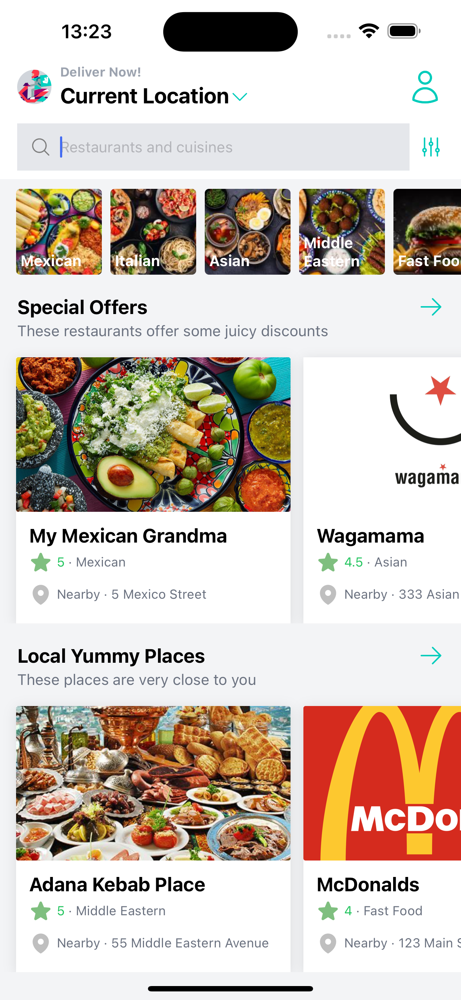
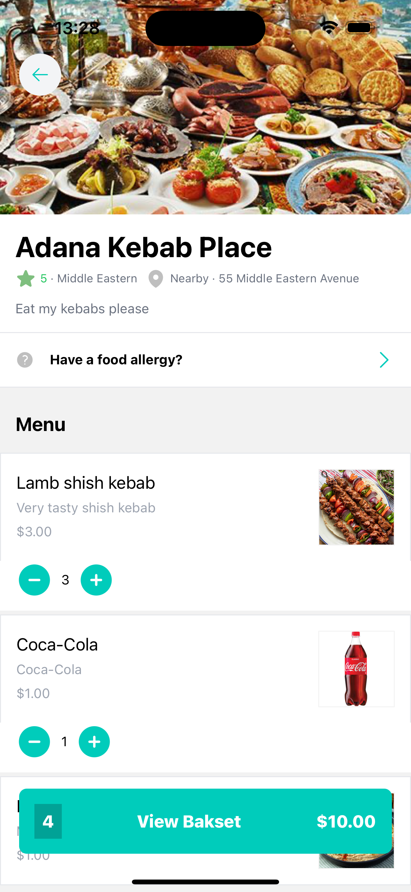
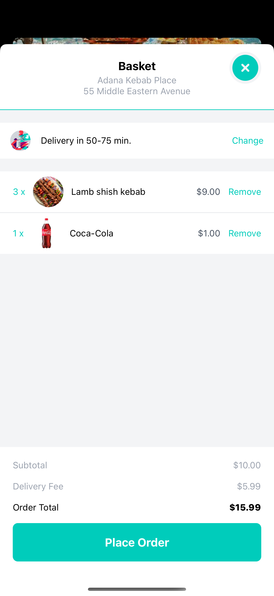
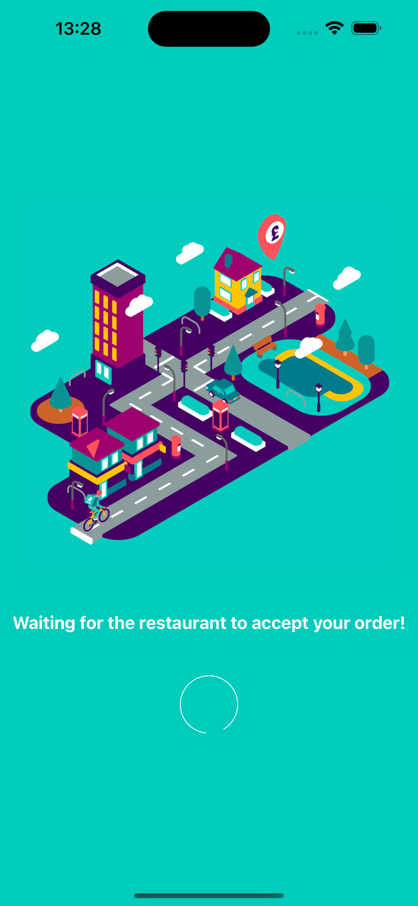
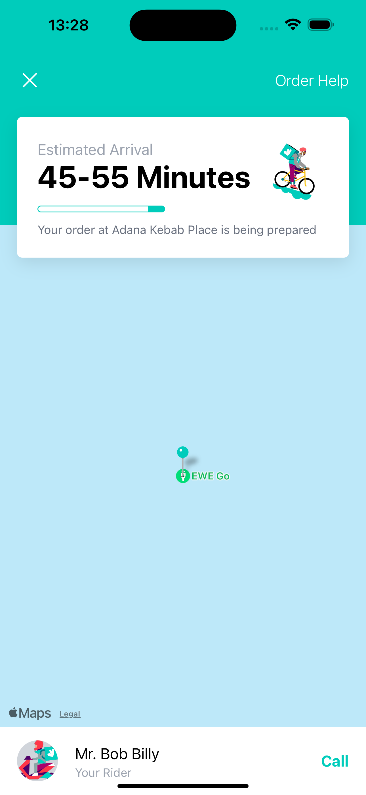

# Foobar

Delivery is a food delivery app created with React Native (Expo), Tailwindcss, Redux

**Home**



**Restaurant**



**Basket**



**Preparing order**



**Waiting for deliver**




## Installation

Use the package manager [npm](https://www.npmjs.com/) to install dependencies:
```npm i```

## Usage

Once the dependencies installed you can launch the project:
```npm run start```


## Contributing

Pull requests are welcome. For major changes, please open an issue first
to discuss what you would like to change.

## License
[MIT](https://choosealicense.com/licenses/mit/)